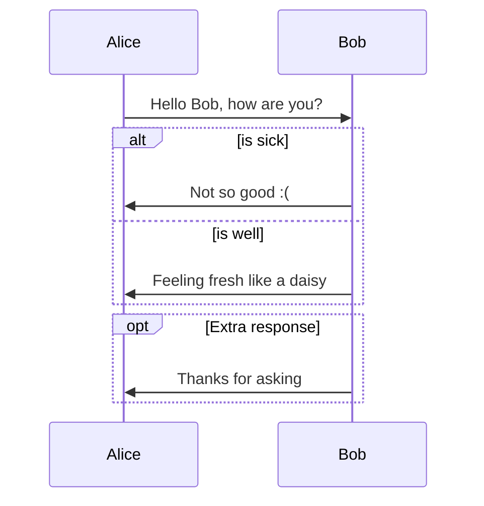

# Markdown


Auf dieser Seite werde ich meine Erfahrungen mit Markdown und Visual Code dokumentieren.

Diese Notitzen sollen für mich als Hilfe dienen, was mir Markdown alles möglich ist.


```

```mermaid
%% Example of sequence diagram
  sequenceDiagram
    Alice->>Bob: Hello Bob, how are you?
    alt is sick
    Bob->>Alice: Not so good :(
    else is well
    Bob->>Alice: Feeling fresh like a daisy
    end
    opt Extra response
    Bob->>Alice: Thanks for asking
    end
```
